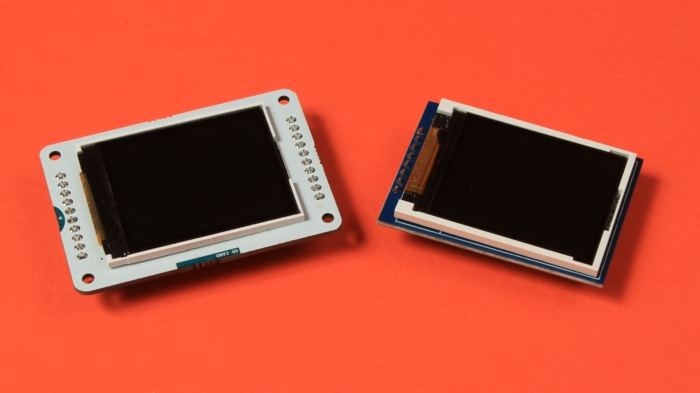
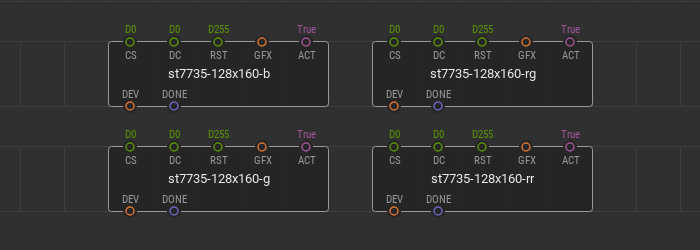
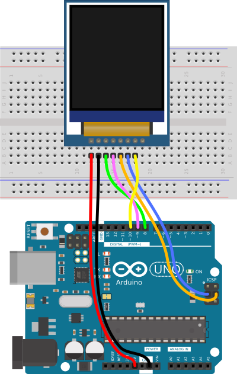
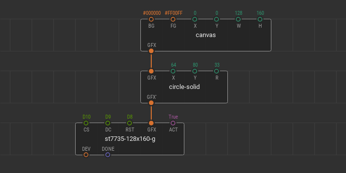
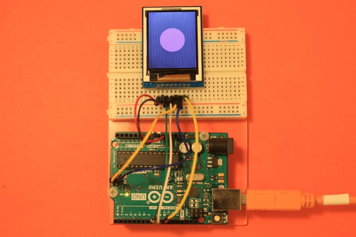
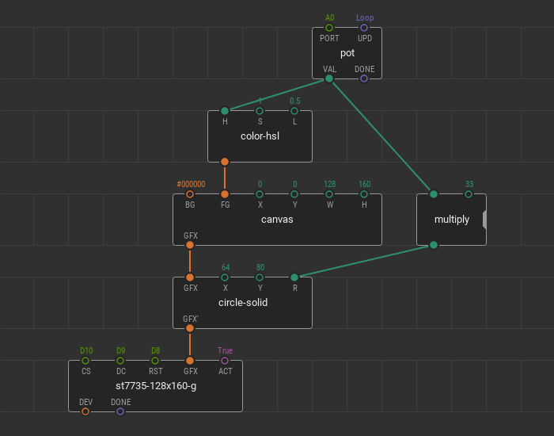

# ST7735 displays

The ST7735 display is a TFT LCD that is controlled by the ST7735/ST7735S/ST7735B micro-chip driver, which acts as a bridge between the display matrix and the microcontroller.
These colorful displays are cheap, easy to connect and control. Therefore, they spread widely in the Arduino world and their popularity gave rise to many breakout board variations. The displays breakout boards belong to the ST7735 family can have the following parameters:

- Display Resolution:
  - 0.96" (80x160 pixels);
  - 1.44" (128x128 pixels);
  - 1.8" (128x160 pixels);
- Display Colors (Color mode):
  - 16-bit "High color", 65,536 colors;
  - 18-bit, 262,144 colors; 
- Interfaces:
  - SPI interface (software of hardware);
  - Parallel MCU interface (8-bit, 9-bit, 16-bit & 18-bit);

To work with the ST7735 family displays XOD provides the [`xod-dev/st7735-displays`](/libs/xod-dev/st7735-displays) library.

Note
At the moment, the library allows to work only with displays with a resolution of 128x160 pixels, 16-bit color depth, and connected via hardware SPI bus.

## Quick start nodes

ST7735 breakout boards can differ from each other and require different initialization methods. Therefore, the `xod-dev/st7735-displays` library contains 4 quick-start nodes at once - [`st7735-128x160-b`](/libs/xod-dev/st7735-displays/st7735-128x160-b), [`st7735-128x160-g`](/libs/xod-dev/st7735-displays/st7735-128x160-g), [`st7735-128x160-rg`](/libs/xod-dev/st7735-displays/st7735-128x160-rg), and [`st7735-128x160-rr`](/libs/xod-dev/st7735-displays/st7735-128x160-rr). Each of these nodes works with a display of a certain type conventionally named "B", "G", "RG", and "RR". With a specific display on your hands you can try each of these nodes and find out which type your display belongs to.

Wire your display to the microcontroller via hardware SPI bus and fill in the `CS`, `DC`, `RST` pin values according to the microcontroller ports. The `CS` is the "Chip Select" microcontroller port of the SPI interface. `DC` is the "Data/Command" microcontroller port responsible for sending data and commands to the display driver.

The `RST` pin is the "Reset" microcontroller port the display is connected to. This port is responsible for the display reset which can be required during device initialization. Not all ST7735 breakout boards have this pin. If your ST7735 breakout board has this pin, be sure to link it with a microcontroller and set the appropriate port value at the `RST` pin. If your breakout board does not have an `RST` pin, then leave the `D255` default value untouched.

The `GFX` input pin of the `graphics` type specifies the graphics to render and display on the device screen. The `GFX` awaits a branch of the tree of graphical elements created using the [Graphics library](/docs/guide/graphics-library). The [boolean](/docs/reference/data-types/#boolean-literals/) value at the `ACT` pin is responsible for updating the display screen if the incoming graphics at the `GFX` pin change.

## Quick start example

Here is a simple example of using quick-start nodes. For example, We use an ST7735 128x160 SPI display of a "G" type. Connect it to a microcontroller according to the wiring scheme.

Use the hardware SPI bus. Connect the display's `CS` pin to the `D10` controller port, and the `DC` pin to the `D9` port. The breakout board of the display used in this example has an `RST` pin, so it should be wired. The `RST` pin is connected to the `D8` port.

Let's display a pink filled circle in the center of the screen.

Put the quick-start node `st7735-128x160-g` onto the patch and fill in ports values `CS`, `DC`, and `RST` according to the wiring scheme. Using the [XOD Graphics library](/docs/guide/graphics-library), create a new `canvas` with the size of a display screen. The width `W` of the `canvas` is `128` and the height `H` is 160. The background color `BG` is set to black (`#000000`) and the foreground color `FG` to pink (`#FF00FF`).

To add the filled circle to the scene, place the `circle-solid` node onto the patch. To make this node be a part of the graphic tree, link its `GFX` pin with the `GFX` pin of the `canvas`. Set the circle coordinates for the center of the screen, `64` for `X`, and `80` for `Y`. The radius `R` can be random, for example, `33`.

The scene is ready. Connect the `GFX` output pin of the `circle-solid` node to the `GFX` pin of the quick-start node. Take a look at what the patch should be.

Upload this patch and see what is displayed on the screen of the device.

You can change all parameters of the graphic nodes in a real-time.

For example, you can change the color of the circle and its position on the canvas using tweaks. Add two [`tweak-number`](/libs/xod/debug/tweak-number) nodes for the `X` and `Y` circle coordinates and one [`tweak-color`](/libs/xod/debug/tweak-color) node for the foreground color of the canvas. Flash the patch in debug mode.

<video controls autoplay muted loop>
    <source src="./quickstart-example-with-tweaks.mp4" type="video/mp4">
</video>

The parameters of graphic nodes can be changed using other nodes. For example, you can change the color of the circle and its size using a potentiometer. Remove tweak nodes from the patch. Place new nodes `pot`, `multiply`, and `color-hsl` node from the `xod/color` library. We connected the potentiometer to the `A0` Arduino port.

With the combination of `pot` and `multiply`, the `R` radius of the circle changes from `0` to `33` pixels. With the combination of `pot` and `color-hsl`, the `H` hue of the `FG` foreground color of the canvas changes from `0` to `1`. Upload the patch and manage the graphics changes.

<video controls autoplay muted loop>
    <source src="./quickstart-example-with-nodes.mp4" type="video/mp4">
</video>
